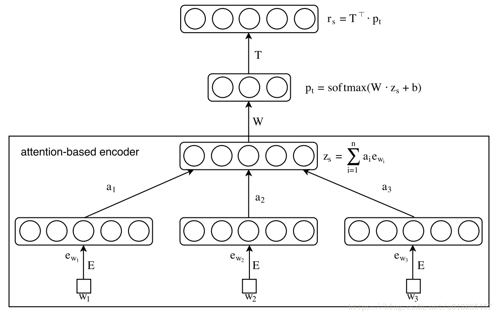

# Attention-based Aspect Extraction (ABAE)

## Prerequisite
- run <code> pip install -r requirements.txt</code> to setup the environment

## How to run
- <code>train_wv.py</code> train word embeddings from dataset
- <code> train.ipynb </code>: detailed procedure of training ABAE model
- <code>python test.py [query]</code> will find the most related verses to query, the reuslts via ABAE will be stored at ./output/related_verses_ABAE.txt
## File Structure
<pre>
.
|-- ABAE_structure.png
|-- README.md
|-- __pycache__
|   |-- abae.cpython-36.pyc
|   |-- dataset.cpython-36.pyc
|   |-- dataset.cpython-38.pyc
|   |-- embedding.cpython-38.pyc
|   |-- loss.cpython-36.pyc
|   |-- loss.cpython-38.pyc
|   |-- model.cpython-38.pyc
|   |-- train_w2v.cpython-38.pyc
|   `-- train_wv.cpython-38.pyc
|-- abae_centers.npy
|-- dataset.py
|-- embedding.py
|-- loss.py
|-- model.py
|-- output
|   `-- related_verses.txt
|-- requirements.txt
|-- t_kjv.csv
|-- test.py
|-- train.ipynb
|-- train_wv.py
|-- verse2aspect.npy
`-- w2v
    |-- bible_word2vec_org
    `-- bible_word2vec_vocalbulary</pre>

## ABAE Structure

